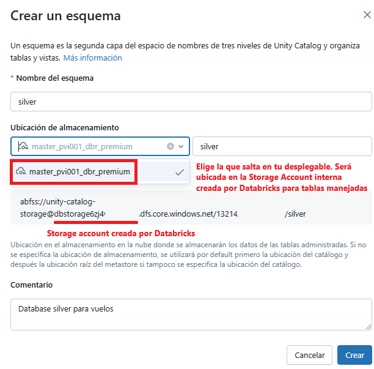

# spark-ejercicios
Paquete de Python con ejercicios de ETL para practicar 

## Primera semana: lectura de datos crudos, preprocesamiento y guardado a fichero

En esta primera semana, escribiremos el código para preprocesar los datos en crudo y obtener datos más utiles y de 
mejor calidad, aunque los guardaremos provisionalmente en otro fichero. El procesamiento será mejorado en la segunda 
semana, para que el destino de los datos transformados sean tablas de Databricks en lugar de un fichero. 

* Modificar en el fichero JSON de configuración la propiedad `raw_input_file` que contiene la ruta del fichero CSV 
de vuelos, para adecuarse al nombre de tu contenedor de ADLS.
* Modificar también `DATABRICKS_PROFILE` para adecuarlo al perfil que hayas puesto en tu fichero `.databrickscfg` 
* Completar el método `preprocesa` de la clase `Featurizer`, que recibe un DF y devuelve un nuevo DF preprocesado:
  * Reemplaza los nulos por 0 en las columnas CarrierDelay, WeatherDelay, NASDelay, SecurityDelay, LateAircraftDelay.
  * Convertir la columna Diverted en booleana, traduciendo el 0.0 al valor False, y cualquier otro valor, al valor True.
  * Crear una nueva columnan FlightTs (timestamp) que contenga el instante de salida del vuelo como timestamp, lo cual
  incluye la fecha (columna FlightDate) y la hora (hora local en el aeropuerto de salida). Hay varias maneras de
  conseguir esto, aunque es importante evitar usar una UDF.
    * Crear un test unitario del método `preprocesa`. Para ello, tendrás que crear un nuevo entorno virtual que no
    tenga instalado databricks-connect, sino pyspark==3.5.0 (misma versión del DBR 15.4 que usamos en el cluster),
    y configurarlo para usarlo en el test. Necesitarás instalar el paquete pytest que hay en el requirements.txt. En
    el test, debes crear un DF de juguete con las condiciones de un DF sin procesar, y comprobar que se ha llevado a
    cabo correctamente el preprocesamiento y que los valores del DF resultante son correctos.
* Crear un featurizer e invocar a `preprocesa` en el flujo diario.

## Segunda semana: creación de databases y guardado en bronze y silver

* En Databricks, mediante interfaz gráfica, crear las databases `bronze` y `silver`.
  * En realidad, bronze y silver podrían ser catálogos completos, en los cuales las databases se crearían según dominios de negocio,
  tales como productos, clientes, reclamaciones, etc, donde cada database agruparía distintas tablas de ese dominio funcional.
  Aquí para simplificar, usaremos un sólo catálogo (el que ya viene creado con el mismo nombre de la instancia de Databricks)
  y crearemos databases para los niveles de calidad del dato (bronze, silver, gold), en lugar de crear catálogos de bronze, silver y gold.
* Modificar el fichero JSON de configuración con los valores adecuados para el destino de las tablas, y la fecha de procesamiento.
  * En caso de estar en blanco, generalmente indicaría algo como *procesar los datos de ayer*, pero aquí significará 
  procesar los datos completos.
  
* Leer el fichero de vuelos, que debe estar situado en la ruta de ADLS indicada en el json, y solo para la fecha indicada en el JSON.

#### Instrucciones para crear databases en Databricks

